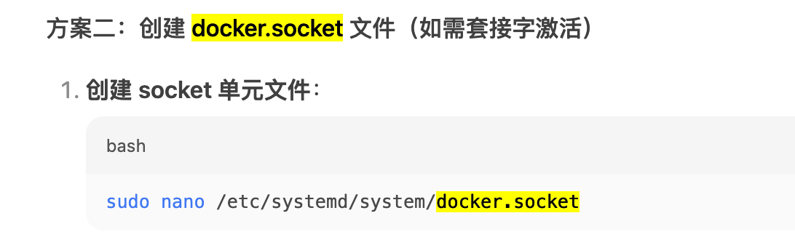

# The docker service of systemd unit

When you manually installed docker binary, you can use the following command to start the docker service.

## make sure required service are active and running

```shell
systemctl status network-online.target containerd.service multi-user.target
# If it is not active and running, you can use the following command to start it.
systemctl daemon-reload
systemctl enable --now containerd
```

### containerd.service
> can refer to (containerd)https://github.com/containerd/containerd/blob/main/containerd.service

[containerd.service](containerd.service)


## prepare service unit file

### docker.service
> can refer to (docker)https://github.com/moby/moby/blob/master/contrib/init/systemd/docker.service
> 
> I removed the `docker.socket` from the `docker.service` file.
> 
> 
> 
> You can also add [docker.socket](docker.socket), but the file is not verified to work.
> 
> 
> 

[docker.service](docker.service)

```shell
systemctl daemon-reload
systemctl enable --now docker
```

## FAQ
### Q: How to check the syntax of service unit file?
> [systemd-analyze](https://www.freedesktop.org/software/systemd/man/latest/systemd-analyze.html) can be used to analyze the systemd unit file.
### Q: Why ssh can not be connected when use github-docker.service?
> A: The `docker.service` file contains firewalld.service, which will block the ssh connection.